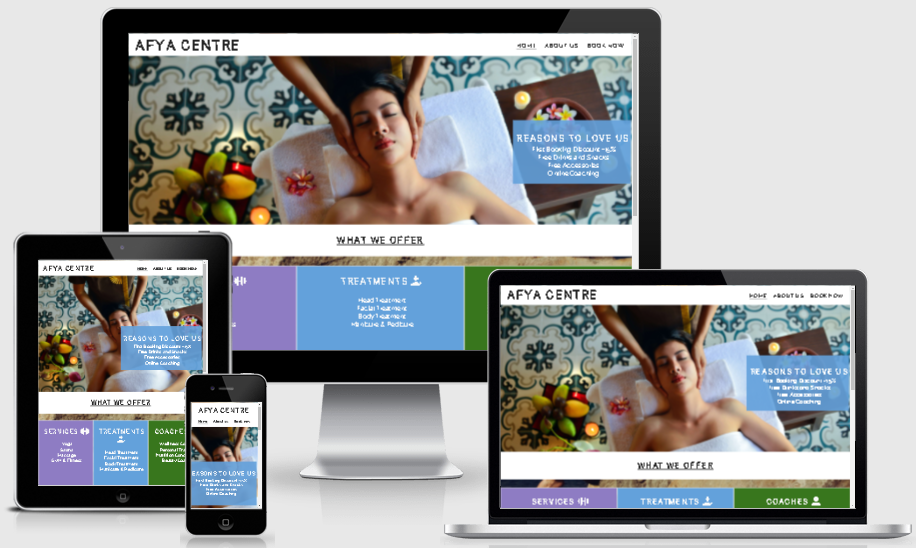

# AFYA CENTRE

[View the live project here](https://georgette-lumbe.github.io/afya_centre/)

# Table of contents

1. [Introduction](#introduction "Goto introduction")

2. [User Experience](#user-exprience "Goto user exprience")

    - [Ideal User Demographic](#ideal-user-demographic "Goto ideal user demographic")
    - [User Stories](#user-stories "Goto user stories")
    - [Development Planes](#development-planes "Goto development planes")
    - [Design](#design "Goto design")

3. [Features](#features "Goto features")

    - [Existing & Design Features](#existing-&-design-features "Goto existing & design features")
    - [Features to Implement in the future](#features-to-implement-in-the-future "Goto features to implement in the future")

4. [Testing](#testing "Goto testing")

    - [Validator testing](#validator-testing "Gotot validator)

5. Issues and Bugs

6. Technologies Used

    - Main Languages Used
    - Libraries, Frameworks & Programs Used

7. [Deployment](#deployment "Goto deployment")

    - [Deploying on GitHub Pages](#deploying-on-github-pages "Goto deploying on Github pages")
    - [Forking the Repository](#forking-the-reposiitory "Goto forking the repository")
    - [Creating a Clone](#creating-a-clone "Goto Creating a Clone")

8. [Credits](#credits "Goto credits")

    - [Content](#content "Goto content")
    - [Media](#media "Goto media")
    - [Code](#code "Goto code")

9. [Acknowledgements](#acknowledgements "Goto acknowledgements")
---

# Introduction

## WELCOME TO AFYA CENTRE!

Afya Centre is an informative website that focuses on human wellness and offers many types of services and treatments to help people maintain their physical health and beauty. Afya Centre aims to guide man into a better lifestyle with different experienced coaches who provide advice, information about health and prevention of illness.

The focus of this website is the registration of people who need us. As everyone deserves to feel good, Afya Centre is open to everyone, young and old. 
This is the first of five Milestone Projects that the developer must complete during his Full Stack Web Development at The Code Institute. The main requirements were to make a responsive and static website with a minimum of three pages using primarily HTML5 and CSS3.

# UX

## Ideal User Demographic

### The ideal user of this website is:

* Potential Bookers
* New Bookers
* Current Clients
* Old Clients

## User Stories

### As a potential booker:

1. I want to navigate easily through the relevant information:

    * Contact details
    * Opening & closing hours
    * Services & Treatments
    * Coaches
    * Book page

2. I want to navigate to the centre’s social media links
3. I would like to know what advantages I will have once I book
4. I would like to be able to see an overview of what is happening in the centre in photos or video, to get an idea.

### As a new booker:

1. I want to navigate easily through the centre's information
2. I want to learn more about the centre and the way they do things
3. I want to be familiar with the centre and with the coach who will accompany me during my sessions
4. I want to easily navigate to the centre’s social media links to keep up to date with the latest news and releases.

### As a current client:

1. I want to navigate to information about upcoming services.
2. I want to stay up to date on new offers and promotions from the Centre so that I can take advantage of them.

### As an old client:

1. I want to navigate through the centre’s social media links to see the latest and upcoming news, and releases.

## Development planes

To create an informative and easy-to-navigate site, Afya Centre worked with its developer to discern the required functionality of the site and how it would respond to the stories and expectations of users, as described above.

### Strategy

#### The website will be focus on the following three categories of target audiences:

##### Demographic
1. 18 years and over
2. People of the 3rd and 4th age
3. All residents and Irish citizens

##### Position

1. New clients
2. Current clients
3. Wellness lovers
4. People in need of care
5. Careless people
6. Companies (for their employees)

##### Psychographics:

1. Types of people:
     * Hard worker
     * Extraverted
     * Careful people
     * People with aches and pains
     * People who want to lose weight
     * People who want to feel better
     * People who want to maintain a healthy lifestyle
     * People who are willing to invest in their well-being
     * People who are not comfortable in their own skin/body

2. Activities:
     * Workers in all fields
     * Sportsmen and women

#### The website needs to facilitate the user to:

1. Retrieve the desired information:
    * The list of services and treatments provided
    * Some pictures of the services provided
    * The location and the opening & closing hours of the centre
    * The benefits
    * Contact information 
    * Find the centre on these social platforms
    * Be able to see the different coaches and their specialities

2. Book 

#### The website needs to facilitate the centre to:

1. Continue to have an online presence
2. Provide a comprehensive, understandable, and informative website for users to find relevant information such as: services & treatments, photos
3. Collect as much user data as possible (name, email address & phone number) in order to serve them better and to keep them informed 
4. Provide a communication channel for new and existing customers (social links - easily accessible on the site)
5. Get more bookers.

### Scope

There are two categories of requirements that were defined in order to clearly identify what needed to be done to align the functionality with the previously defined strategy.

1.	Content Requirements:

    * The user will be looking for:
         The different services and treatments offered
        o The coaches available
        o Information about price
        o The location of the centre
        o Photos and video
        o How to book
        o Social links
        o Contact details

2.	Functionality Requirements:

    * The user will be able to:
        o Stay connected 
        o Find links to external sites in order to get more information, to see more photos, videos, and testimonials
        o Navigate easily through the site to find the information they want.
        o Contact the centre directly through the communication channel of your choice.
        o Find the route to the centre (all locals).

### Structure

The website has been organised in a hierarchical tree structure to allow users to navigate the site easily and efficiently, with the following results:

### Skeleton

Wireframe mock-ups were created in a balsamiq workspace with providing a positive user experience in mind.

## Design

1. Typography

* A combination of [Pangolin](https://fonts.google.com/specimen/Pangolin?query=pangolin) and [Raleway](https://fonts.google.com/?query=raleway) fonts is used throughout the website, with Sans Serif as a back-up font in case of import failure.
* For elements that needed to be highlighted, bold, italic, and underlined were used with the aim of emphasising these elements.

2.	Colour scheme

* The main colours used on the site are a mixture of blue and green, with purple accents.
The chosen (cool) colour palette reflects peace, is appreciated for its restful qualities, and evokes calmness and freshness. Cool colours have a very soft effect and are generally considered to be the colours of the night. They are the colours of nature, water and inspire sobriety, calm and relaxation.

3.	Imagery

* The selected imagery and video are authentic and aesthetically consistent, showing an overview of what is happening at Afya Centre. The imagery is eye-catching and visually represents the theme of the website.

* All images provide alternative text for use in the event that the element cannot be rendered.

# FEATURES

## Existing & Design features

### HOME PAGE

1. Header Logo & Navigation Bar

    * The website has a consistent responsive navigation system that is found on every page and allows users to navigate easily from page to page without complications
    * The header contains a conventionally placed logo at the top left of the page (redirects the user to the home page with one click) and a navigation bar at the top right of the page.
    * The header is fixed so the user can see it if he goes to the bottom of the page.

[Header](assets/docs/screenshots/header-screenshot.PNG)

2. Landing page image

    * The landing includes an animated photograph with text overlay in the blue square to allow the user to directly see the benefits and discounts of the Afya Centre, this makes the section attractive for the user.

    IMAGE

3. Services section

    * This section will allow the user to see all services, treatments, and coaches that the Afya Centre offers. 
    * This section is represented by three rectangular boxes of different colours (blue, green, and purple) align horizontally with a fixed background image.

IMAGE

4. Location section

    * This section will allow the user to see all the local of the Afya Centre and the opening & closing hours for all the local.
    * The where to find us section, it represented by four square boxes (three first for locals and last one for opening and closing hours) with the same background image.

IMAGE

5. Footer section

    * This section provides the email address, phone number and links to the main Afya centre social pages, just click on the icon to be redirected to the platform of the centre of your choice

    * This section is on every page of the website and allows customers to stay in touch with the centre via social media, email, and telephone. 

IMAGE

### ABOUT US PAGE

6. Video section

    * This [video](https://www.youtube.com/watch?v=e6T4eUFZMaA&t=48s) section will provide a video which shows the view of one of the service in Afya Centre and the user can see and control it all along.

IMAGE

7. Information section

    * This section will provide the main information about the Afya Centre such as the purpose, some details about the price and what they do so the user can know a more about the centre.

IMAGE

8. User rating section

    * The user will be able to see other users' experiences and how many stars they gave to Afya Centre .

IMAGE

9. Coach section 

    * This section will allow the user to see all Afya Centre coaches, their names, specialities, and years of experience. This will increase the user's confidence as he will already know who they are working with.
    * The Coach section is represented by four square boxes of coaches’ pictures with their name, specialities, and years of experience below.

IMAGE

### BOOK NOW PAGE

1. This page will allow the user to make a reservation at the Afya Centre for the chosen treatments. 
    * The user will be asked to provide:
        o Full name, email address 
        o Gender and age
        o Date and time
        o Services and treatment required

    * The user will be able to specify which coach he wants
    * Finally, the user will be asked to book
    * This section is represented by a background-image with text overlay and the call-to-action button at the bottom.

IMAGE

### SUBMIT PAGE

1. A thank you message will be addressed to the user when he will book.

## Features to implement in the future

1. Blog and testimonial pages
    * Features: add a blog page and a testimonial page, where the user can experience the atmosphere of Afya centre without having set foot there, can see the feelings of others and some advice.
    * Reason for not featuring in this release: It is advisable to make at least three pages for this project

2. Gallery and price list pages
    * Features: add a gallery page, where the user can view in details all services, treatments and prices in Afya Centre. 
    * Reason for not featuring in this release: It is advisable to make at least three pages for this project

# Testing

* Validator testing

# Issues and Bugs

# Technologies used 

1. Main Languages Used
    * [HTLM5](https://fr.wikipedia.org/wiki/HTML5)
    * [CSS3](https://en.wikipedia.org/wiki/CSS)

2. Libraries, Framework & Programs Used

    * [Balsamiq](https://balsamiq.com/wireframes/?gclid=Cj0KCQjwna2FBhDPARIsACAEc_XbjAS__pJWBfq4NdpfXxxOVWlh4qsEro7gWthlg3GopXgZgB5PkeQaAiu-EALw_wcB) was used to create the wireframe during the design and reflective phase of the project.
    * [Google fonts](https://fonts.google.com/) was used to import the fonts “…”, “…” and “…” into the style.css file. These fonts were used all over the project.
    * [Fonts awesome](https://fontawesome.com/) was used on all pages throughout the website to import icons for the user experience purposes for example social media links, phone number and email address.
    * [Git](https://git-scm.com/) was used for version control by using the GitPod terminal to commit to Git and push to GitHub.
    * [GitHub](https://github.com/) was used to store the project after pushing.
    * [Am I Responsive?](http://ami.responsivedesign.is/#) was used to view the responsive design throughout the process and to generate image mock-ups for use.

# Deployment

## Deploying on GitHub pages
## Forking the Repository
## Creating a clone

# Credit

1. Content
    * The text used for the About Us page is sourced from [Healthline](https://www.healthline.com/program/about-us).

2. Media
    * Some images were sourced from [Unsplash](https://unsplash.com/) and others from [Pexels](https://www.pexels.com/).
    * The video user for the About Us page is sourced from [Youtube](https://www.youtube.com/watch?v=e6T4eUFZMaA&t=48s).

3. Code
    * The developer has consulted some websites in order to better understand and use the code for this site. Below are the sites used:

        o [W3Schools](https://www.w3schools.com/)
        o [Stack Overflow](https://stackoverflow.com/)
        
# Acknowledgements
